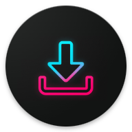
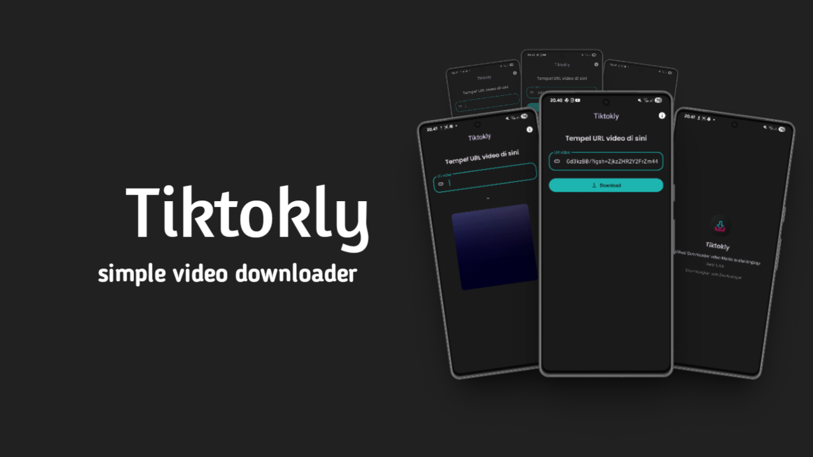
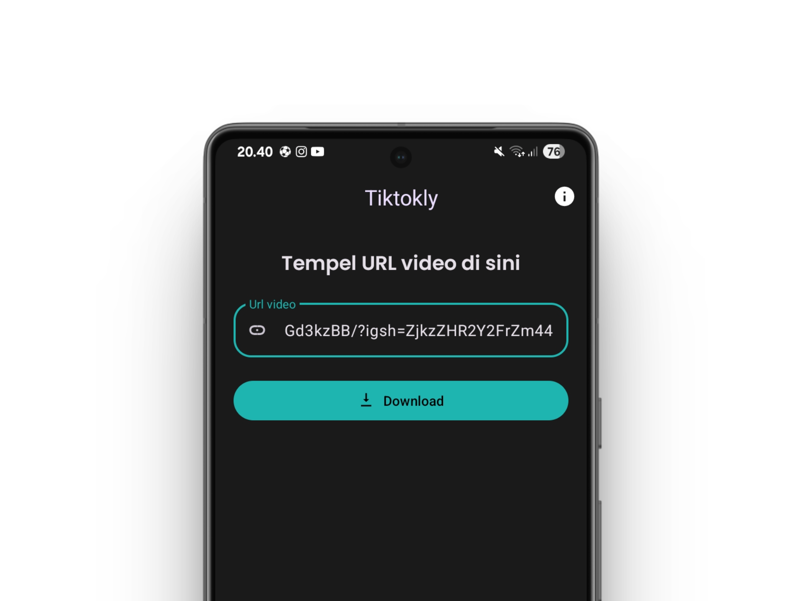

<h2 align="left"><b>Tiktoly</b></h2>

  A simple video downloader for Tiktok, YouTube, Instagram and other 

<!-- Latest release -->

<!-- Build and test -->
<!--  -->
<!-- Crowdin -->

  
  

## Features

- **Video downloader**: Fast and high quality.
- **Support all media social**: Supoorted media social, example: Tiktok, Instagram, YouTube (deprecated).
- **Simple and minimalist**: Simple and minimalist appearance and easy to use.
- **Responsive Design**: Adapts to any screen size.
- **Language**: Available in Bahasa Indonesia.

## Screenshot

| Feature        | Screenshot   |
| -------------- | ------------ |
|    Home        | |

## License

This project is licensed under the MIT License - see the [LICENSE](LICENSE) file for details.

---
